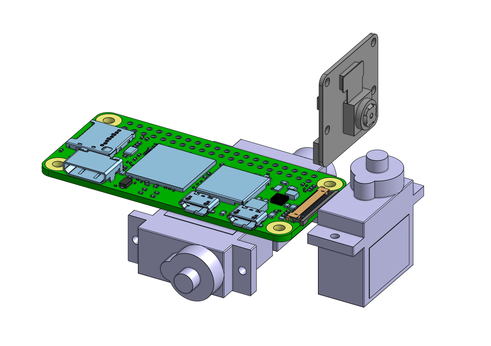
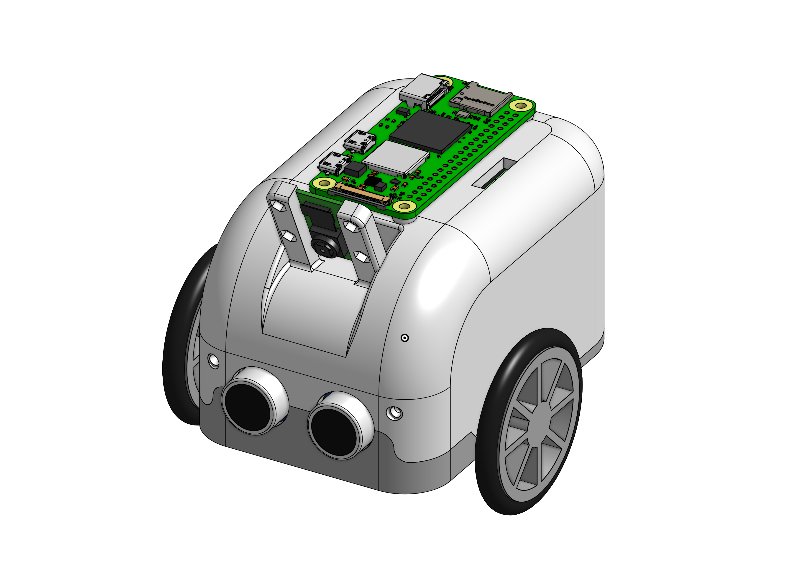

# 3D model for the car

This is a folder with images of all 3D models.

The parts were made (and are stored) in
[onShape](https://www.onshape.com/en/).

-----------------------------------------------------------

## Latest update:

Imported all the current parts. This is a visualization of how the parts will be placed in the final case.

> Actually made it completely different...

This is the whole assembly: All components + created parts

-----------------------------------------------------------

*The whole model can be found on the onShape cloud: [MyLittleScriptingCar](https://cad.onshape.com/documents/853826ab736a7e89ca60314d/w/e4e5486c53d8f1f4ba14f67f/e/c2fb18a20a1dab14190ffd40)*

*The model is also under HUGE development and I just don't want to spend that much time just exporting and copying files.*
