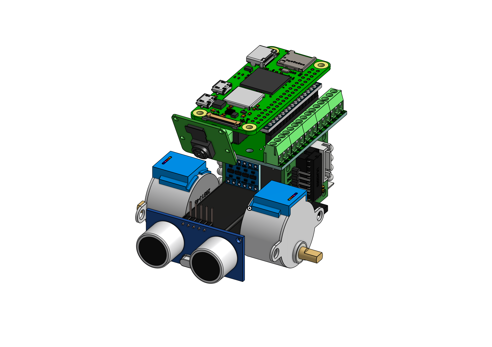

# 3D model for the car

This is a folder with all 3D model files.

The [car_model.FCStd](./car_model.FCStd) is deprecated,
because I moved from [FreeCAD](https://www.freecadweb.org/)
to [onShape](https://www.onshape.com/en/).

-----------------------------------------------------------

## Latest update:

Imported all the current parts. This is a visualization of how the parts will be placed in the final case.

The battery holder, charger, IMU and servo driver remains.

-----------------------------------------------------------

*There are no other files, because they're stored in the onShape cloud: [MyLittleScriptingCar](https://cad.onshape.com/documents/853826ab736a7e89ca60314d/w/e4e5486c53d8f1f4ba14f67f/e/c2fb18a20a1dab14190ffd40)*

*The model is also under HUGE development and I just don't want to spend that much time just exporting and copying files.*
